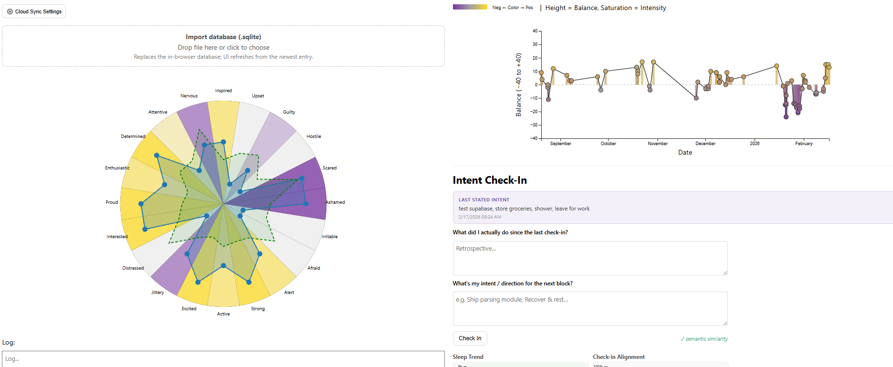

# minimal_mood_dashboard
Minimalistic journalling dashboard based on PANAS — works locally or hosted on GitHub Pages with optional multi-device cloud sync.



Inspired by a post from [forth](https://x.com/forthrighter/status/1957524801377169619). Self-contained enough to just open in a browser, but also deployable as a static site with cloud sync.

## Quick start

**Local only** — open `index.html` in Chrome. Data is stored in the browser (localStorage). Done.

**GitHub Pages + cloud sync** — deploy to Pages, then:

1. Create a free [Supabase](https://supabase.com) project.
2. Run the SQL below in the Supabase SQL Editor to create the sync table:
   ```sql
   CREATE TABLE user_data (
     id              uuid PRIMARY KEY DEFAULT gen_random_uuid(),
     user_id         uuid REFERENCES auth.users(id) NOT NULL UNIQUE,
     encrypted_blob  text NOT NULL,
     updated_at      timestamptz DEFAULT now()
   );
   ALTER TABLE user_data ENABLE ROW LEVEL SECURITY;
   CREATE POLICY "Users access own data"
     ON user_data FOR ALL
     USING (auth.uid() = user_id);
   ```
3. In Supabase → **Authentication → URL Configuration**, set:
   - **Site URL** → your Pages URL (e.g. `https://you.github.io/minimal_mood_dashboard/`)
   - **Redirect URLs** → same URL
4. On the dashboard, click **⚙️ Cloud Sync Settings**, paste your Supabase project URL and anon key, and save.
5. Enter your email and click **Send magic link**. Open the link in your inbox — you're synced.
6. On another device, repeat steps 4–5 with the same email. Data merges automatically.

Data is protected by Supabase Row Level Security — only the authenticated user can read/write their own row.

## Intent Calibration Module

A lightweight **3-hour check-in** system sits below the PANAS dashboard:

| Feature | Details |
|---|---|
| **Retrospective / Prospective** | Free-text "What did I do?" → "What's my intent for the next block?" |
| **Target direction** | Concise phrase you're steering toward (e.g. "Ship parsing module") |
| **Alignment scoring** | Cosine similarity between previous intent and current retrospective. Uses sentence embeddings (Transformers.js) when served via HTTP, bag-of-words fallback from `file://` |
| **Drift feedback** | Neutral prompt when alignment drops below threshold — "Was this shift intentional or reactive?" |
| **Collapse early warning** | Rolling 7-day heuristic across sleep, PANAS strain signals, and alignment trend. Suggests 10% downshift when ≥ 2 flags fire |
| **Notifications** | Browser `Notification` API reminders every 3 hours (08:00–20:00), configurable |

### Semantic similarity (optional)

For best alignment scoring, serve the dashboard from a local server so the embedding model can load:

```bash
python -m http.server 8000
# then open http://localhost:8000
```

From `file://` everything works — alignment just uses text-overlap instead of embeddings.

### Files

```
index.html          – main dashboard (PANAS windrose + timeseries)
js/sync.js          – cloud sync module (Supabase auth + merge)
js/intent.js        – intent calibration module (check-in, alignment, collapse warning)
README.md
```
